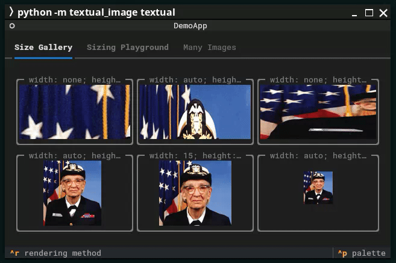

# textual-image
[](https://pypi.org/project/textual-image/)
[](https://pypi.org/project/textual-image/)
[](https://github.com/lnqs/textual-image/actions/workflows/publish.yml)
[](https://www.pepy.tech/projects/textual-image)

**Render images directly in your terminal using [Textual](https://www.textualize.io/) and [Rich](https://github.com/Textualize/rich).**



_textual-image_ offers both Rich renderables and Textual Widgets that leverage the [Terminal Graphics Protocol (TGP)](https://sw.kovidgoyal.net/kitty/graphics-protocol/) and [Sixel](https://en.wikipedia.org/wiki/Sixel) protocols to display images in your terminal. For terminals that don't support these protocols, fallback rendering using Unicode characters is available.

## Supported Terminals

- **Terminal Graphics Protocol (TGP)**: Initially introduced by the [Kitty](https://sw.kovidgoyal.net/kitty/) terminal emulator. While support is partially available in other terminals, it doesn't seem to be really usable there.
- **Sixel Graphics**: Supported by various terminal emulators including [xterm](https://invisible-island.net/xterm/) and a lot of others.

_Note_: As implementation of these protocols differ a lot feedback on different terminal emulators is very welcome.

See the Support Matrix below on what was tested already.

### Support Matrix [^1]

[^1]: Based on [Are We Sixel Yet?](https://www.arewesixelyet.com/)

| Terminal            | TGP support | Sixel support | Works with textual-image |
|---------------------|:-----------:|:-------------:|:------------------------:|
| Black Box           |          ❌ |            ✅ |                       ✅ |
| foot                |          ❌ |            ✅ |                       ✅ |
| GNOME Terminal      |          ❌ |            ❌ |                          |
| iTerm2              |          ❌ |            ✅ |                       ✅ |
| kitty               |          ✅ |            ❌ |                       ✅ |
| konsole             |          ✅ |            ✅ |                       ✅ |
| tmux                |          ❌ |            ✅ |                       ✅ |
| Visual Studio Code  |          ❌ |            ✅ |                       ✅ |
| wezterm             |          ✅ |            ✅ |                       ✅ |
| Windows Console     |          ❌ |            ❌ |                          |
| Windows Terminal    |          ❌ |            ✅ |                       ✅ |
| xterm               |          ❌ |            ✅ |                       ✅ |

✅ = Supported; ❌ = Not Supported

### BlackBox

**Homepage**: https://gitlab.gnome.org/raggesilver/blackbox  
**TGP support**: No  
**Sixel support**: Yes  
**Works**: Yes

**Notes**:  
*Preferences -> Advanced -> Sixel Support* has to be enabled.

Needs to be linked against a version of VTE with Sixel support enabled.
This is the case for the Flatpak version of BlackBox, but not on most Linux distribution's native packages.

### foot

**Homepage**: https://codeberg.org/dnkl/foot  
**TGP support**: No  
**Sixel support**: Yes  
**Works**: Yes

**Notes:**  
Works out of the box, no known issues.

### GNOME Terminal

**Homepage**: https://gitlab.gnome.org/GNOME/gnome-terminal  
**TGP support**: No  
**Sixel support**: No  
**Works**: No

**Notes:**  
Relies on VTE Sixel implementation (<https://gitlab.gnome.org/GNOME/vte/-/issues/253>). While that one is available in an experimental state, I didn't find any resources if it's somehow possible to enable Sixel support on the terminal.

### iTerm2

**Homepage**: https://iterm2.com/  
**TGP support**: No  
**Sixel support**: Yes  
**Works**: Yes

**Notes:**  
Works out of the box.

### Kitty

**Homepage**: https://sw.kovidgoyal.net/kitty/  
**TGP support**: Yes  
**Sixel support**: No  
**Works**: Yes

**Notes:**  
Works out of the box.

### Konsole

**Homepage**: https://konsole.kde.org/  
**TGP support**: Partially  
**Sixel support**: Yes  
**Works**: Yes

**Notes:**  
TGP support is not in a usable state. However, Sixel is working out of the box with a few minor graphical glitches in Textual.

### tmux

**Homepage**: https://github.com/tmux/tmux/wiki  
**TGP support**: No  
**Sixel support**: Yes  
**Works**: Partially

**Notes:**  
tmux doesn't support TGP, even on a TGP enabled terminal nothing will render. Sixel generally works, but heavily depends on the underlying terminal. In some terminals it works great, in others major bugs occur, even if the terminal without tmux works.

### Visual Studio Code

**Homepage**: https://code.visualstudio.com/  
**TGP support**: No  
**Sixel support**: Yes  
**Works**: Yes

**Notes:**  
The `terminal.integrated.enableImages` setting has to be enabled.

### WezTerm

**Homepage**: https://wezfurlong.org/wezterm/index.html  
**TGP support**: No  
**Sixel support**: Yes  
**Works**: Yes

**Notes:**  
Works out of the box.

### Windows Console

**TGP support**: No  
**Sixel support**: No  
**Works**: No

**Notes:**  
Windows Console and Windows Terminal are two different pieces of software. The latter one is supported.

### Windows Terminal

**Homepage**: https://github.com/microsoft/terminal  
**TGP support**: No  
**Sixel support**: Yes  
**Works**: Yes

**Notes:**  
Sixel support was added in version 1.22, which is currently the pre-release.

### xterm

**Homepage**: https://invisible-island.net/xterm/  
**TGP support**: No  
**Sixel support**: Yes  
**Works**: Yes

**Notes:**  
Sixel on xterm is disabled by default. To enable it, add `+lc` and `-ti vt340` options when launching xterm:

```sh
xterm +lc -ti vt340
```

Alternatively, you can add these options to your xterm configuration file (`~/.Xresources` or `~/.Xdefaults`) to make the change permanent:

```sh
echo 'XTerm*decTerminalID: vt340' >> ~/.Xresources
xrdb -merge ~/.Xresources
```

## Installation

Install _textual-image_ using pip with the following commands:

For the basic installation:
```sh
pip install textual-image
```

To include the Textual Widget's dependencies:
```sh
pip install textual-image[textual]
```

## Demonstration

Once installed, run the demo application to see the module in action.

For a demonstration of the Rich renderable, use:
```sh
python -m textual_image rich
```

For a demonstration of the Textual Widget, use:
```sh
python -m textual_image textual
```

The module will automatically select the best available rendering option. If you wish to specify a particular rendering method, use the `-p` argument with one of the following values: `tgp`, `sixel`, `halfcell`, or `unicode`.

For more information, use:
```sh
python -m textual_image --help
```

## Usage

### Rich Integration

To use the Rich renderable, simply pass an instance of `textual_image.renderable.Image` to a Rich function that renders data:

```python
from rich.console import Console
from textual_image.renderable import Image

console = Console()
console.print(Image("path/to/image.png"))
```

The `Image` constructor accepts either a string, a `pathlib.Path` representing the file path of an image readable by [Pillow](https://python-pillow.org/), or a Pillow `Image` instance directly.

By default, the image is rendered in its original dimensions. You can modify this behavior by specifying the `width` and/or `height` parameters. These can be defined as an integer (number of cells), a percentage string (e.g., `50%`), or the literal `auto` to automatically scale while maintaining the aspect ratio.

`textual_image.renderable.Image` defaults to the best available rendering method. To specify an explicit rendering method, use one of the following classes: `textual_image.renderable.tgp.Image`, `textual_image.renderable.sixel.Image`, `textual_image.renderable.halfcell.Image`, or `textual_image.renderable.unicode.Image`.

### Textual Integration

For integration with Textual, _textual-image_ offers a Textual `Widget` to render images:

```python
from textual.app import App, ComposeResult
from textual_image.widget import Image

class ImageApp(App[None]):
    def compose(self) -> ComposeResult:
        yield Image("path/to/image.png")

ImageApp().run()
```

The `Image` constructor accepts either a string or a `pathlib.Path` with the file path of an image readable by [Pillow](https://python-pillow.org/), or a Pillow `Image` instance directly.

You can also set the image using the `image` property of an `Image` instance:

```python
from textual.app import App, ComposeResult
from textual_image.textual import Image

class ImageApp(App[None]):
    def compose(self) -> ComposeResult:
        image = Image()
        image.image = "path/to/image.png"
        yield image

ImageApp().run()
```

If a different image is set, the Widget will update to display the new image.

By default, the best available rendering option is used. To override this, you can instantiate `textual_image.widget.TGPImage`, `textual_image.widget.SixelImage`, `textual_image.widget.HalfcellImage`, or `textual_image.widget.UnicodeImage` directly.

_*Note*_: The process of determining the best available rendering option involves querying the terminal, which means sending and receiving data. Since Textual starts threads to handle input and output, this query will **not work** once the Textual app has started. Therefore, make sure that `textual_image.renderable` is imported **before** running the Textual app (which is typically the case in most use cases).

## Limitations

- **High Sixel images in Rich**: As terminal emulators don't implement the Sixel protocol exactly consistent, a workaround to get the cursor position in Rich right had to be implemented. This breaks as soon as the image is higher that the terminal window itself. Rendering will still happen, but the image may be displaced and borders around it may be broken.
- **Sixel Support in Textual**: Sixel support in Textual is not particularly performant due to the way Textual handles rendering. The Sixel graphics are injected into the rendering process in a somewhat hacky manner, which affects performance. Scrolling and changing styles of images can lead to a lot of flickering. But for mostly static images it should work fine. If not, please file an issue on GitHub.

## Contribution

If you find this module useful, please consider starring the repository on GitHub.

This project began by moving some TGP functionality from a private project to a public GitHub repository and PyPI package, with some additional code added along the way to support Sixel graphics. If you encounter any issues, please file an issue on GitHub.

Contributions via pull requests are welcome and encouraged.
