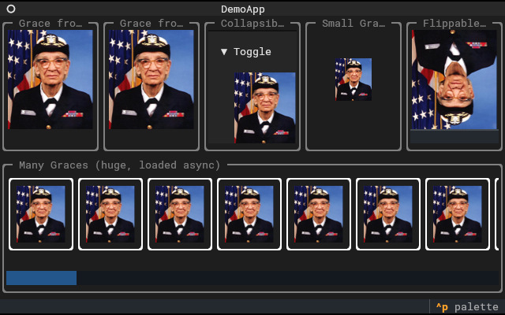

# textual-kitty

Render images in the terminal with [Textual](https://www.textualize.io/) and [rich](https://github.com/Textualize/rich).



_textual-kitty_ provides a rich _renderable_ and a Textual _Widget_ utilizing the [Terminal Graphics Protocol](https://sw.kovidgoyal.net/kitty/graphics-protocol/) to display images in terminals. For terminals not supporting the TGP fallback rendering as unicode characters is available.

## Supported Terminals

The _Terminal Graphics Protocol_ was introduced by [Kitty](https://sw.kovidgoyal.net/kitty/) is is fully supported in this terminal.
[WezTerm](https://wezfurlong.org/wezterm/index.html) has a mostly complete implementation. [Konsole](https://konsole.kde.org/) and [wayst](https://github.com/91861/wayst) have partial support.

However, this module was only tested with _Kitty_. Feedback for other terminals is welcome.

## Installing

Install _textual-kitty_ via pip:

```
pip install textual-kitty
```

for the rich renderable, or

```
pip install textual-kitty[textual]
```

to also include the Textual Widget's dependencies.

## Demo

With the package installed, run

```
python -m textual_kitty rich
```

for a demo of the _rich_ renderable or

```
python -m textual_kitty textual
```

for a demo of the _Textual_ Widget.

It'll pick the best available rendering option. If you want to see the other ones, use the `-p` argument to specify `tgp`, `colored-fallback`, or `grayscale-fallback`.

See

```
python -m textual_kitty --help
```

for more information.

## Usage

### rich

Just pass a `textual_kitty.renderable.Image` instance to a _rich_ function rendering data:

```python
from rich.console import Console
from textual_kitty.rich import Image

console = Console()
console.print(Image("path/to/image.png"))
```

The `Image` constructor accepts a `str` or `pathlib.Path` with a file path of an image file readable by [Pillow](https://python-pillow.org/) or a Pillow `Image` instance.

Per default, the image will render full terminal width or the width of the parent container. A `width` parameter can be passed to the constructor to overwrite this behavior and explicitly specify the width of the image in terminal cells.
The aspect ratio of the image will be kept in both cases.

`textual_kitty.renderable.Image` is automatically set to the best available rendering option.
You can also explicitly choose how to render by using one of `textual_kitty.renderable.tgp.Image`, `textual_kitty.renderable.fallback.colored.Image`, or `textual_kitty.renderable.fallback.grayscale.Image`.

### Textual

_textual-python_ provides an Textual `Widget` to render images:

```python
from textual.app import App, ComposeResult
from textual_kitty.widget import Image

class ImageApp(App[None]):
    def compose(self) -> ComposeResult:
        yield Image("path/to/image.png")

ImageApp().run()
```

The `Image` constructor accepts a `str` or `pathlib.Path` with a file path of an image file readable by [Pillow](https://python-pillow.org/) or a Pillow `Image` instance.

Additionally, the image can be set with the `image` property of an `Image` instance:

```python
from textual.app import App, ComposeResult
from textual_kitty.textual import Image

class ImageApp(App[None]):
    def compose(self) -> ComposeResult:
        image = Image()
        image.image = "path/to/image.png"
        yield image

ImageApp().run()
```

If another image was set before, the Widget updates to display the new data.

The `Image` constructor accepts a `load_async` parameter. If set to `True`, the first render of the image (and subsequent ones after a resize) will not actually render the image, but start processing the image data asynchronously. The Widget will update itself when this is done to show the image. A loading indicator is shown during processing. This helps to keep the app responsive if large images are passed to this class.
But it does come with the overhead of double the update cycles and running asynchronous tasks.

This again uses the best available rendering option. To override this behavior, specify `image_renderable_type` in the widget's constructor as one of  `textual_kitty.renderable.tgp.Image`, `textual_kitty.renderable.fallback.colored.Image`, or `textual_kitty.renderable.fallback.grayscale.Image`.

Please note determining the best available rendering option queries the terminal. This means data is sent to and read from it.
As Textual starts threads to handle input and output, this query doesn't work anymore once the Textual app is started.
In practice, this means `textual_kitty.renderable` needs to be imported _before_ Textual runs (which should be the case in most use cases anyway).

## Contribution

If you find this module helpful, please leave this repository a star.

For now, I just moved this functionality from a private project to a public GitHub repo/PyPI package. It works fine for my use case, please fill a bug ticket if you encounter unexpected behavior.

And, of course, pull requests are welcome.