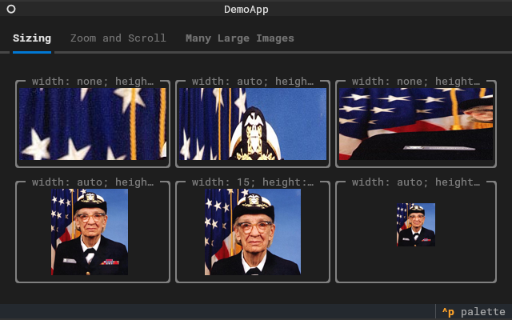
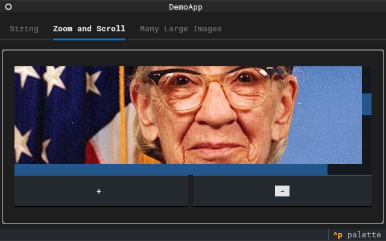

# textual-kitty

*Render images directly in your terminal using [Textual](https://www.textualize.io/) and [Rich](https://github.com/Textualize/rich).* 



&nbsp;&nbsp;&nbsp;


_textual-kitty_ offers both a Rich renderable and a Textual Widget that leverage the [Terminal Graphics Protocol (TGP)](https://sw.kovidgoyal.net/kitty/graphics-protocol/) protocol to display images in your terminal. For terminals that don't support TGP, fallback rendering using Unicode characters is available.


## Supported Terminals

The _Terminal Graphics Protocol_ (TGP) was initially introduced by the [Kitty](https://sw.kovidgoyal.net/kitty/) terminal emulator and is completely supported therein. Additionally, TGP is largely implemented in [WezTerm](https://wezfurlong.org/wezterm/index.html) and partially supported by [Konsole](https://konsole.kde.org/) and [wayst](https://github.com/91861/wayst).


_Note_: Testing has been conducted primarily using Kitty. Feedback and interoperability testing on other terminal emulators would be highly valued.

## Installation

Install _textual-kitty_ using pip with the following commands:

For the basic installation:
```sh
pip install textual-kitty
```

To include the Textual Widget's dependencies:
```sh
pip install textual-kitty[textual]
```

## Demonstration

Once installed, run demo application to see the module in action.

For a demonstration of the Rich renderable, use:
```sh
python -m textual_kitty rich
```

For a demonstration of the Textual Widget, use:
```sh
python -m textual_kitty textual
```

The module will automatically select the best available rendering option. If you wish to specify a particular rendering method, use the `-p` argument with one of the following values: `tgp`, `halfcell`, or `unicode`.

For more information, use:
```sh
python -m textual_kitty --help
```

## Usage

### Rich Integration

To use the Rich renderable, simply pass an instance of `textual_kitty.renderable.Image` to a Rich function that renders data:

```python
from rich.console import Console
from textual_kitty.renderable import Image

console = Console()
console.print(Image("path/to/image.png"))
```

The `Image` constructor accepts either a string, a `pathlib.Path` representing the file path of an image readable by [Pillow](https://python-pillow.org/), or a Pillow `Image` instance directly.

By default, the image is rendered in its original dimensions. You can modify this behavior by specifying the `width` and/or `height` parameters. These can be defined as an integer (number of cells), a percentage string (e.g., `50%`), or the literal `auto` to automatically scale while maintaining the aspect ratio.

`textual_kitty.renderable.Image` defaults to the best available rendering method. To specify a explicit rendering method, use one of the following classes: `textual_kitty.renderable.tgp.Image`, `textual_kitty.renderable.halfcell.Image`, or `textual_kitty.renderable.unicode.Image`.

### Textual Integration

For integration with Textual, _textual-kitty_ offers a Textual `Widget` to render images:


```python
from textual.app import App, ComposeResult
from textual_kitty.widget import Image

class ImageApp(App[None]):
    def compose(self) -> ComposeResult:
        yield Image("path/to/image.png")

ImageApp().run()
```

The `Image` constructor accepts either a string or a `pathlib.Path` with the file path of an image readable by [Pillow](https://python-pillow.org/), or a Pillow `Image` instance directly.

You can also set the image using the `image` property of an `Image` instance:

```python
from textual.app import App, ComposeResult
from textual_kitty.textual import Image

class ImageApp(App[None]):
    def compose(self) -> ComposeResult:
        image = Image()
        image.image = "path/to/image.png"
        yield image

ImageApp().run()
```

If a different image is set, the Widget will update to display the new image.

By default, the best available rendering option is used. To override this, you can instantiate `textual_kitty.widget.TGPImage`, `textual_kitty.widget.HalfcellImage`, or `textual_kitty.widget.UnicodeImage` directly.

_*Note*_: The process of determining the best available rendering option involves querying the terminal, which means sending and receiving data. Since Textual starts threads to handle input and output, this query will **not work** once the Textual app has started. Therefore, make sure that `textual_kitty.renderable` is imported **before** running the Textual app (which is typically the case in most use cases).

## Contribution

If you find this module useful, please consider starring the repository on GitHub.

This project began by moving some TGP functionality from a private project to a public GitHub repository and PyPI package, with some additional code added along the way. If you encounter any issues, please file an issue on GitHub.

Contributions via pull requests are welcome and encouraged.
